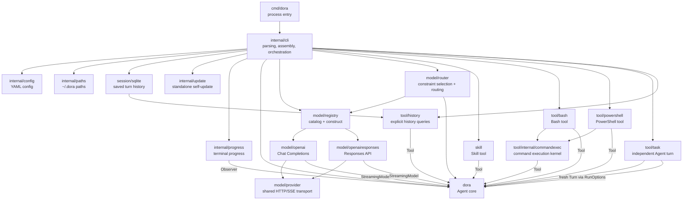
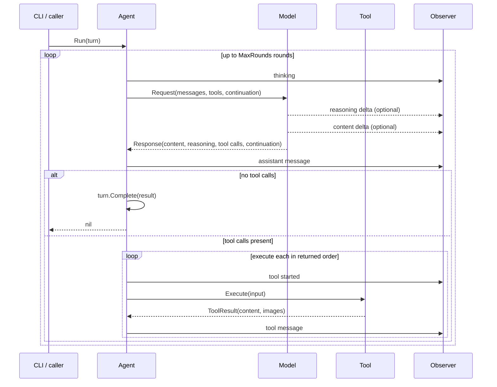

# Dora Architecture

This document describes the module boundaries, dependencies, primary interfaces, and runtime flow of the current Dora implementation. It records the current state, not future plans; when code behavior changes, this document should be updated accordingly.

## Design Goals

Dora is a small, composable LLM agent. The core design principles are:

- The core loop depends only on a small set of interfaces, not on any concrete model, tool, CLI, or storage implementation.
- Each package has a single primary responsibility; cross-package access happens through explicit interfaces or data structures.
- The CLI is the composition root, responsible for selecting and assembling implementations; the core packages do not read configuration or environment variables.
- One mutable `Turn` is explicitly passed to the Agent; `Agent` holds immutable model, tool, safeguard, and system-prompt configuration and no mutable state across tasks.
- All external operations accept `context.Context`, supporting cancellation and timeouts.

## Overall Structure



Key constraints on dependency direction:

- The root package `dora` does not import any concrete implementation package within the project. `dora.Capability` and `dora.Constraints` are root value types shared by `model/registry` and `model/router` without an import cycle.
- Model adapters and tool packages depend on the interfaces and data structures in `dora`.
- `internal/*` serves only the Dora application and cannot be imported directly from outside the module.
- `internal/cli` knows all concrete implementations and is the composition root; model assembly is delegated to `model/router` (selection) and `model/registry` (construction).

## Directories and Modules

| Module | Responsibility | Primary interface or entry point |
| --- | --- | --- |
| `dora` | Domain abstractions for the agent loop, messages, models, tools, and observers | `New`, `NewWithConfig`, `Agent.Run*`, `Model`, `Tool`, `Observer` |
| `cmd/dora` | Process startup, signal handling, terminal capability detection, final error output | `main` |
| `internal/cli` | Argument parsing, dependency assembly, turn execution, and terminal turn commit | `Run(context.Context, []string, IO)` |
| `internal/config` | Strict reading, parsing, and validation of YAML configuration | `Load(string)` |
| `internal/imagefile` | Validates local image files and encodes them as data URLs | `Validate`, `DataURL` |
| `internal/paths` | Resolves Dora's default configuration and skill paths | `ConfigFile`, `SkillsDir` |
| `session` | Defines saved-turn history contracts and query records | `Reader`, `Store` |
| `session/sqlite` | Appends completed, maximum-round, and failed turns to a user-selected SQLite file | `Open`, `Store.CommitTurn`, `Store.CommitMaxRounds`, `Store.CommitFailed`, `Store.ListTurns`, `Store.GetRounds` |
| `internal/update` | Queries stable Releases, validates archives, and replaces the standalone binary with rollback | `New`, `Service.Update` |
| `internal/progress` | Renders semantic run events as terminal output | `New`, `Renderer.Observe` |
| `model/provider` | Shared HTTP transport, retry, SSE, and error infrastructure for model adapters | `New`, `Provider.PostStream` |
| `model/openai` | OpenAI-compatible Chat Completions SSE protocol adapter | `New`, `Client.GenerateStream` |
| `model/openairesponses` | Responses API, SSE stream, and provider continuation adapter | `New`, `Client.GenerateStream` |
| `model/registry` | Catalog registration/query (order = priority) and per-protocol adapter construction | `NewCatalog`, `Catalog.Providers`, `Construct` |
| `model/router` | Constraint-based selection, `dora.Model` routing with caching; internal `selection` | `New`, `Router.Generate`, `Router.GenerateStream`, `Router.View`, `Router.SetThinking` |
| `skill` | Discovers and validates local `SKILL.md`, returns full instructions to the model on demand | `New`, returns `dora.Tool` |
| `tool/bash` | Executes Bash within the current directory with background transition and output-limit constraints | `New`, `Tool.Spec`, `Tool.Execute` |
| `tool/powershell` | Executes PowerShell using `pwsh` or `powershell.exe` | `New`, `Tool.Spec`, `Tool.Execute` |
| `tool/history` | Gives the model paginated access to saved turns and rounds | `New`, `Tool.Spec`, `Tool.Execute` |
| `tool/viewimage` | Loads a local image file or remote URL and returns a text description via a transient visual model | `New`, `Tool.SetViewer`, `Tool.Spec`, `Tool.Execute` |
| `tool/task` | Runs an instruction through the same Agent in a fresh Turn, excluding itself from the nested run | `New`, `Tool.Spec`, `Tool.Execute` |
| `tool/internal/commandexec` | Implements input validation, process execution, background transition via wait_seconds, and structured results for command tools | `New`, `Tool.Spec`, `Tool.Execute` |

## Core Interfaces

### Model

```go
type Model interface {
    Generate(context.Context, Request) (Response, error)
}

type StreamingModel interface {
    Model
    GenerateStream(context.Context, Request, func(ModelEvent)) (Response, error)
}

type ContextSize interface {
    ContextSize() int
}
```

`Model` is the minimal interface that every model implementation must satisfy. `StreamingModel`, `ContextSize`, and `OutputSize` are optional capabilities: when the Agent detects `StreamingModel` it uses the streaming method, otherwise it falls back to `Generate`; when it detects `ContextSize` and the reported value is positive it uses it as the context token budget for compaction, otherwise it falls back to `DefaultContextWindowTokens`; when it detects a positive `OutputSize.MaxOutputTokens`, it treats that value as the model's hard output capacity. These capabilities leave the `Model` and `StreamingModel` contracts unchanged.

`Request` contains the complete provider-neutral messages, available tool definitions, and an opaque `Continuation`. `Response` can contain both text and multiple tool calls.

`Response` also carries an optional `Usage *Usage` payload describing the tokens a single model call consumed (input, output, and total, plus optional `InputTokenDetails`/`OutputTokenDetails` breakdowns). Input details include cached and audio tokens; output details include reasoning, audio, and accepted/rejected prediction tokens. It is provider-neutral, populated by the adapters, and is `nil` when a provider reports no usage or is not asked for it. Usage is carried by the `UpdateMessageReceived` observer event on every complete round, retained on the corresponding `Round` or final `Turn`, persisted by session storage, and used by the compactor as the previous round's `total_tokens` occupancy baseline (falling back to a token estimate when usage is nil). The renderer does not display it.

`dora` provides `InputTokens`/`TotalTokens` as pure-function exits for accounting context usage from a `dora.Usage` (provider-neutral and nil safe); normalization conversion from provider wire formats remains in the adapters' private helpers.

### Tool

```go
type Tool interface {
    Spec() ToolSpec
    Execute(context.Context, json.RawMessage) (ToolResult, error)
}

type ToolResult struct {
    Content string
}
```

`Spec` exposes the name, description, and JSON Schema to the model. `Execute` receives only the model-generated JSON arguments and returns content for the resulting tool message. The core Agent does not know the concrete type of a tool and does not parse tool-specific output conventions or access image files.

Within the same Agent, tool names must be non-empty and unique. Tool definitions are copied when the Agent is constructed, preventing the caller from later modifying their JSON Schemas.

`RunObservedWithOptions` accepts per-run `RunOptions`. Its `ExcludeTools`
names are removed from both the definitions sent to the model and the lookup
map used for execution. `WorkingDirectory` is carried through the run context
and is available to tools through `dora.WorkingDirectory`; the Agent does not
change process state or interpret the path. Built-in filesystem, image, and
command tools use it as the base for relative paths. `Run` and `RunObserved`
retain their original APIs and delegate with empty options. Options are local
to a run and never mutate the Agent, so independent Turns may use different
tool sets and working directories concurrently.

### Observer

```go
type Observer interface {
    Observe(Update)
}
```

The Observer synchronously receives semantic events such as `thinking`, reasoning deltas, content deltas, assistant message received (`message_received`), tool started, and tool finished (`tool_finished`, carrying the tool's success result or its error). The former `message_added`, `tool_failed`, and `usage` events have been removed. It only consumes run data, does not participate in Agent decisions, and cannot modify the session history.

After the Agent obtains a complete response for a round (tool or final) it emits an `UpdateMessageReceived` event carrying that round's assistant message and the optional `Response.Usage` (`nil` when the provider reports none; usage is carried but never rendered). Each tool call then emits an `UpdateToolFinished` after its `UpdateToolStarted`: on success it carries the tool result message, and on failure it carries a non-nil `Err`. The `internal/progress.Renderer` displays the assistant message, renders each tool line (splitting success/process-level failure by `Err`, and letting content-level signals such as bash exit codes drive warning/failure styling), and does not print usage; `--quiet` silences the renderer entirely.

Callbacks run on the Agent's current goroutine, so implementations should return quickly. `internal/progress.Renderer` is the Observer used by the CLI.

### Turn and Round

```go
type Round struct {
    Assistant Message
    Tools     []Message
    Usage     *Usage
}

agent, err := dora.NewWithConfig(model, dora.AgentConfig{
    SystemPrompt: systemPrompt,
}, tools...)
turn := dora.NewTurn(userInput)
err := agent.Run(ctx, turn)
result, complete := turn.Result()
```

`Turn` is the Agent's mutable run state. It is constructed from one user input.
On its first run, the Agent binds a snapshot of its immutable system prompt to
the Turn; an empty prompt omits the system message. The Turn then appends only
complete rounds and ends with a final assistant result without tool calls. A
round contains one assistant message with one or more tool calls, all
corresponding tool messages in call order, and the optional usage reported for
that model call. The Turn separately retains the final response usage, exposed
through `Turn.Usage`. Provider continuation is opaque and exists only in the
live Turn; it is not persisted. All exported accessors return defensive copies.

## Agent Loop



Current execution semantics:

- The Agent is immutable and owns the system prompt; mutable messages, the bound system-prompt snapshot, and continuation belong to the supplied Turn.
- A run may exclude tools without mutating the Agent; excluded tools are neither advertised nor executable for that run.
- Input messages, tool calls, and output state are all defensively copied.
- Tool packages translate tool-specific output conventions into `ToolResult`; the Agent only forwards its content and images into the provider-neutral message history.
- When the model returns multiple tool calls, they are executed concurrently, but their results and Observer events are emitted in the returned order. Tools must be safe for concurrent use; the built-in command and skill tools are.
- Content from both APIs can be displayed as it is received, but tools must wait until the entire model response has finished before execution begins.
- A tool execution error, an unknown tool, or invalid JSON tool arguments does not terminate the task: the Agent feeds the failure back to the model as a `tool` message so the model can correct itself, and continues the loop. A tool itself may choose to encode a command failure as a normal result. For example, Bash returns a non-zero exit code to the model rather than terminating the Agent directly.
- If the model keeps calling tools, reaching `MaxRounds` returns `ErrMaxRounds`; the completed rounds remain in the same Turn. The CLI may call the Agent again with that Turn after interactive confirmation. Continuing does not persist an intermediate record. Declining, a non-interactive failure, or an event-daemon failure persists the Turn with status `max_rounds` when a session is configured; non-interactive runs still report the error directly.
- The CLI constructs the Agent with the configured `agent.system_prompt` (which fully replaces the built-in default) or, when unset, the default embedded at `internal/cli/prompts/default_system.md`. Each Turn receives a snapshot from that Agent when it starts. Session-history behavior is described by the history tool itself rather than duplicated in the system prompt.
- Before each normal model request, the Agent predicts context occupancy and leaves the history untouched until the prediction, including an output reserve, reaches 80% of the model-reported `contextWindow`. The estimate anchors on the previous normal call's real `total_tokens`, which already includes that request's tool schema and assistant response, then adds only tool results produced afterwards. Without reported usage it estimates the complete model-visible history and tool schemas using about four ASCII bytes or one non-ASCII rune per token plus a small framing allowance; vision tokens remain provider-specific and unestimated. At the threshold, the Agent calls the active model with the complete model-visible history plus a summary instruction, but with no tools and no opaque continuation. The replacement summary must be non-empty, contain no tool calls, and fit within 20% of the context window, capped further by the model's optional hard output capacity. The effective target is attached to the summary `Request` as `MaxOutputTokens`, overriding the model profile's ordinary per-response `max_tokens`; adapters defensively clamp it to the hard capacity again. An oversized or empty summary gets one stricter retry, while a non-empty response that reached the provider output limit remains acceptable. Only a validated summary atomically replaces the model-visible history, as the original system message followed by one user summary message. The capacity check returns a `CompactionResult` containing the selected history, whether compaction succeeded, predicted token counts before and after the attempt, summary tokens, context/trigger/target token limits, and the number of summary attempts. Failure aborts the run without deleting or locally truncating messages, while preserving the available attempt statistics for diagnostics. The complete `Turn` remains unabridged for persistence. Because provider continuation state belongs to the replaced message history, successful compaction clears it before the next normal request; subsequent rounds continue from the new continuation returned for the summarized history. Successful compaction emits one `UpdateInfo` notification with the before/after predicted token counts, without exposing summary streaming deltas.

## CLI Run Flow

`internal/cli.Run` is responsible for the complete lifecycle of one command:

1. Parse arguments; `--version` and `-update` complete and exit before reading configuration or the prompt.
2. For a normal Agent run, compose the user prompt from command arguments and standard input.
3. Resolve the default or explicit configuration path; when the default file does not exist, use the built-in DeepSeek configuration, and when it does exist, strictly load the YAML. An explicitly specified configuration file that does not exist still reports an error.
4. Apply one-shot overrides such as `--max-rounds` and `--thinking` to the selected catalog entry, and validate `--workdir` as an existing directory before resolving it to an absolute path.
5. Open the active SQLite session: the file selected by `--session`, or an in-memory database when the option is omitted. Register a history tool backed by its Reader interface from the first turn; never load old turns into the model request.
6. Create the concrete model adapter based on the selected profile's effective API and model.
7. Discover skills and create the other available tools according to configuration.
8. Add the default-enabled task tool, construct an immutable `dora.Agent` with its system prompt, and create a fresh `dora.Turn` from the user input.
9. Run the Agent with the resolved working directory, reusing only that Turn if the user confirms continuation after `ErrMaxRounds`.
10. On success, atomically append the completed Turn to SQLite and write its final text to stdout. If execution stops at the maximum-round limit, append a `max_rounds` Turn before returning, declining, or continuing the event loop. For any other run error, append a `failed` Turn with its error and completed tool rounds before returning or continuing the event loop; partial streamed model output is not retained on the Turn and is not written.

The CLI's standard output carries only the final result; run progress and errors are written to standard error. TTY output is consistent with piped and redirected output, so results can still be safely used in scripts. Progress color defaults to automatic terminal and environment detection; `--color=always|never` overrides it without changing the renderer's terminal-only in-place updates. Reasoning deltas reach the Observer on every run (capture, persistence, and provider resend do not depend on display), but the renderer streams them only when `--reasoning` is passed, one complete line at a time with a size cap for newline-free lines: terminal writes run on the Agent's goroutine, and per-token writes slow the model stream on slow terminals.

`cli.IO` injects the standard streams, build version, terminal capabilities, HTTP client, and test updater, allowing the CLI to be tested without depending on process-global state.

`internal/update` only updates binaries marked by the standalone installer writing a marker in the same directory. It fetches the latest stable Release from GitHub, selects the archive for the running platform, verifies the SHA-256 using `checksums.txt`, and stages and runs the new version's `--version` in the same directory. After successful verification, it switches the binary via a same-directory rename; on installation failure it attempts a rollback and uses an exclusive marker to reject concurrent updates. Development builds, manual copies, and package-manager installations are not modified.

## Model Adapters

### Chat Completions

`model/openai` converts Dora messages and tool structures into `/chat/completions` requests. It always requests an SSE stream, aggregates text and chunked tool arguments into a complete response, and implements `StreamingModel`. Its optional continuation carries structured reasoning details for tool-calling assistant messages when the selected profile enables reasoning preservation.

Reasoning models expose their chain-of-thought in non-standard delta fields. The adapter decodes `reasoning_content`, `reasoning`, and `reason` (first non-empty wins per event), plus visible text or summaries from `reasoning_details`, aggregates them into `Response.Reasoning`, and streams them before content deltas. Whether captured reasoning is resent on tool-calling assistant history messages is controlled by the profile-level `preserve_thinking` switch (default off). Plain reasoning is resent as `reasoning_content`; ordered `reasoning_details` chunks are stored unmodified in the opaque continuation and replayed on their original assistant message. DeepSeek and OpenRouter's built-in profiles enable preservation; providers that expect reasoning stripped keep it off. The final tool-free assistant message is never resent within a turn.

To capture token usage, Chat Completions requests always set `stream_options.include_usage: true`; compliant providers then emit a final chunk with empty `choices` that carries the `usage` block. The adapter decodes that block into `Response.Usage` (mapping `prompt_tokens`/`completion_tokens` onto input/output tokens) and ignores any empty-`choices` chunk without usage. Providers that ignore `stream_options` or omit usage simply leave `Response.Usage` nil — the default, nil-safe degradation. Because most OpenAI-compatible endpoints ignore unknown request fields, this does not break existing streams.

### Responses API

`model/openairesponses` calls `/responses` and parses SSE. It implements `StreamingModel`, passes text deltas to the Agent, and encodes the typed items from the Responses protocol into an opaque continuation.

Reasoning summaries surface when the provider sends them: `response.reasoning_summary_text.delta` events stream as reasoning deltas, and reasoning output items contribute their summary text to `Response.Reasoning`. Summaries are not requested proactively, so providers that only return them on demand keep an empty `Reasoning`.

The Responses `response.completed` event may carry a `usage` block; the adapter decodes it into `Response.Usage` when present and leaves it nil otherwise. Responses streams report usage without any request option.

This continuation is used to preserve data across different CLI processes, such as reasoning, function calls, and function call output, which cannot be fully expressed by generic messages alone. It belongs only to the provider and backend that created it and should not be parsed or modified by other modules.

Both adapters are themselves responsible for:

- the endpoint and authentication headers;
- conversion between Dora messages and protocol messages;
- protocol wrapping of Tool JSON Schemas;
- interpretation of HTTP status and malformed response formats;
- response size or stream event size limits.

Sampling and output-cap settings are per-model configuration threaded into each
adapter's `Config` and emitted in the request body with `omitempty` pointers. `temperature`
has no default and is only sent when explicitly configured, leaving the provider
default sampling otherwise. `max_tokens` defaults to 32768 in the config layer
and is therefore sent for ordinary requests. The optional positive
`max_output_tokens` profile value describes the model's hard output capacity and
has no default. A request-specific `Request.MaxOutputTokens` overrides
`max_tokens`, after which the adapter clamps the result to the hard capacity.
Because the two wire protocols use different key names, the adapters map the
effective request limit to the correct key:
`max_tokens` for Chat Completions and `max_output_tokens` for the Responses API;
`temperature` is common to both. An explicit `max_tokens: 0` is relayed as-is,
meaning "no explicit cap."

Thinking-mode reasoning effort follows the same pattern. The CLI maps a single
`config.Model.Thinking` value (`off | minimal | low | medium | high`, nil by
default) to each protocol's control: Chat Completions emits `reasoning_effort`
for `minimal`–`high` and DeepSeek's `thinking.type: disabled` for `off`;
Responses emits a nested `reasoning` object with `effort: none` for `off` and
the effort value otherwise. The mapping is provider-aware and drops values a
provider does not support (for example DeepSeek ignores `minimal`; OpenAI Chat
Completions ignores `off`), so unsupported settings are silently absent from the
wire rather than erroring. The per-provider policy lives in `internal/cli`, and
the adapters only render the pre-computed fields.

The adapters do not validate the JSON of model-emitted tool-call arguments; they
pass the raw arguments through to the Agent, which is the single authority on
tool-call validity. Invalid arguments are fed back to the model as a recoverable
`tool` message rather than aborting the run.

## Session

The `session` package is a provider-neutral persistence contract. The CLI's
concrete implementation is `session/sqlite`; `--session`/`-s` selects a
persistent SQLite file, while omitting it creates an in-memory SQLite database
for the process lifetime. There is no default session directory and no
automatic loading of prior messages.

The database uses schema version 6 and two tables:

- `turns`: one row per saved invocation, including `status` (`completed`,
  `max_rounds`, or `failed`), optional error, plain-text `system`, `user`, final
  `result`, round count, final-response `usage_json`, and commit time.
  `max_rounds` and `failed` rows have an error and empty result/final usage;
- `messages`: intermediate assistant/tool messages keyed by `turn_id`,
  `round_index`, and `position`. Tool calls and images are JSON columns because
  they are structured fields of a message. Assistant messages also store their
  captured `reasoning`. Assistant rows also store that model call's optional
  `usage_json`; tool rows never carry usage. Like the provider continuation,
  the final response's reasoning is displayed live but intentionally not
  stored, because the final assistant message never enters this table.

`CommitTurn` inserts a completed turn, messages, and per-call usage in one
transaction (no backend metadata). `CommitMaxRounds` stores all complete rounds
plus the limit error, while `CommitFailed` stores all complete rounds plus the
terminal run error. Neither incomplete-turn path stores partial streamed model
output. Provider continuation is intentionally not stored. SQLite allocates the
turn ID and foreign keys bind every message to its turn. Schema version 5 and
older databases are rejected rather than migrated.

`tool/history` is registered from the first turn against the active session.
An empty database is a valid history source whose `list` result is empty.
`list` returns saved turns newest first and includes status, error, and the
number of rounds in each turn. `get` selects one turn by ID and returns a chronological
page of complete rounds; both actions accept `offset` and `limit`. History tool
calls and their results are ordinary messages in the current Turn and are
persisted with it on completion.

New database files are created with mode `0600`. The old versioned JSON session
format, `--fresh`, migration, and compatibility adapters are deliberately not
implemented.

## Skills

A skill is a tool, not text spliced directly into the prompt at startup. This way the model initially sees only the skill name and description, and only calls the `skill` tool to load the full content after deciding it is relevant.

By default, `~/.dora/skills` (or `DORA_HOME/skills`) is discovered first, followed by `~/.agents/skills/`. Each default directory is included only when it exists as a directory; an absent default is silently skipped. When `skills.directories` is configured, the defaults are replaced by exactly those directories (each must be an absolute path or start with `~/`). All resulting paths are converted to absolute form and deduplicated; `--no-skills` takes precedence over all sources and disables skills entirely. Each direct subdirectory must contain a valid `SKILL.md`:

- YAML front matter allows only `name` and `description`;
- the skill name must match the directory name and be globally unique;
- the file must be a regular file and satisfy the count, size, and description-length limits;
- when no default directory exists, or no directory contains a subdirectory with a `SKILL.md`, the entire tool stays disabled;
- when an explicitly configured directory does not exist or is not an absolute/`~/` path, or a skill is malformed, startup fails.

The tool execution result contains the skill's absolute directory and the complete `SKILL.md`, so instructions can reference scripts in the same directory. The skill tool itself does not execute files; execution still requires another explicitly enabled tool, such as Bash.

## Bash Tool

Bash is enabled automatically on Linux and macOS and disabled automatically on other platforms. When it is auto-enabled but the `bash` executable cannot be found, the CLI skips the tool; `enabled: true` can explicitly enable it on any platform, in which case a missing executable causes startup to fail. Discovery currently only checks `PATH` and does not launch a shell to probe the runtime environment. When the tool is available, each invocation executes via `bash -lc` in the run's working directory, falling back to Dora's process working directory when none is set; when the model needs to change directories, it uses `cd` within the command. The tool has the following boundaries:

- a single `wait_seconds` knob that waits up to that many seconds for completion before moving the command to the background (default 10; `0` moves it to the background immediately);
- context cancellation does not terminate an adopted background process (it uses its own lifetime), and adopted processes also keep running after the Dora process exits;
- the result returns the exit code, stdout, and stderr as JSON; a moved-to-background result returns a source-prefixed `job_id` such as `bash_0`;
- stdout and stderr are each capped at 32 KiB per result (head+tail with a marker naming the original size) in the command result, in the background-adoption result, and in job tool polls, so a single oversized command cannot overflow the model request;
- a non-zero command exit is a tool result the model can handle; infrastructure errors such as startup failures are returned as Go errors.

Bash is not a security sandbox. Enabling it is equivalent to allowing the model to execute commands with the system privileges of the Dora process.

## PowerShell Tool

PowerShell is a separate `powershell` tool from Bash, and its input Schema likewise accepts only `command`, preventing the model from mixing the syntax of the two shells in a single call. It is enabled automatically on Windows and disabled automatically on other platforms, and looks for `pwsh` and then `powershell.exe` in order. In automatic mode, when neither exists the CLI skips the tool; when explicitly enabled, it reports an error. Bash and PowerShell can be exposed simultaneously only when the user explicitly overrides the platform policy.

PowerShell executes commands using the same run working-directory rule with `-NoLogo -NoProfile -NonInteractive -Command`, and the model uses `Set-Location` within the command to change directories. It shares the same `wait_seconds` background behavior and structured results as Bash, and is likewise not a security sandbox.

Bash and PowerShell remain separate public tools with separate shell-launch policies, and both delegate to `tool/internal/commandexec` for input validation, process execution, and result encoding. This internal package cannot be imported from outside the module.

## Task Tool

Task is enabled by default and can be disabled with
`tools.task.enabled: false`. Its single `instruction` is executed using the same immutable Agent
and model but a fresh Turn, so parent messages and provider continuation are
not inherited. The nested run binds the same Agent system prompt and uses
`RunObservedWithOptions` to exclude `task` from both
model-visible definitions and executable tools. All other tools and their
underlying process, filesystem, working-directory, and permission state remain
shared; this is conversation-context isolation, not a security sandbox.

Multiple Task calls returned in one response follow the Agent's normal
unbounded concurrent tool execution. Nested runs use no Observer, preventing
parallel child progress from interleaving in the terminal; the outer Task
completion still reports its final result and duration.

Task input also accepts `background: true`. The tool then registers the nested
run with the shared in-memory job manager, returns a `task_N` ID immediately,
and runs the fresh Turn in a context controlled by the job tool rather than the
parent tool call. The existing job tool lists, polls, and kills both command and
Task jobs. Its public protocol has no `kind` field: IDs are generated from the
source tool (`bash_N`, `powershell_N`, or `task_N`) with a separate counter per
source. Polling drains unread command output, but completed Task text or errors
remain available on repeated polls. Kill returns the job's real current state:
`cancelling` while termination is still in progress, the existing terminal
state when the job already finished, and `killed` only after termination is
confirmed. Command cancellation terminates the Unix process group or Windows
process tree. Task cancellation is cooperative and remains `cancelling` until
the nested run observes its context and returns.

Background Tasks have no concurrency limit. They are goroutines in the Dora
process, so they do not survive process exit and any uncollected result is
lost. This differs from adopted command processes, which continue after Dora
exits. Foreground and background Task calls inherit run context values such as
the working directory. Background Tasks deliberately drop the parent deadline
and cancellation while retaining those values, preserving their independent
lifecycle; they remain cancellable through the job tool.

## Configuration and Paths

`internal/config` uses strict YAML decoding for a provider/model-profile catalog: unknown fields, multiple documents, duplicate names, invalid API types, invalid capability values, and invalid limits all report errors. `builtin_providers.yaml` is embedded into the binary and defines the built-in `deepseek`, `trust`, and `openrouter` catalogs, including base URLs and default profiles. Within `providers[].profiles`, `name` uniquely identifies a profile while `model` is the provider-facing model identifier; `model` defaults to `name`, and different profiles may target the same model. A profile's positive `context_window` records its context capacity in tokens; omission defaults to 1048576 tokens. `max_tokens` is the ordinary request budget and defaults to 32768, while optional positive `max_output_tokens` records a hard model capability and has no default. A profile's `capabilities` advertises the provider-neutral capabilities it supports (for example `text`, `image_input`). Explicit user catalog fields override connection defaults, while user profile lists replace rather than merge with built-in profiles. Each provider's API key environment variable is derived by uppercasing its name, replacing non-alphanumeric characters with underscores, and appending `_API_KEY`; a non-empty process value overrides the config-local `env` fallback, and normalization collisions or unknown config env names are rejected. These fallbacks never mutate the process environment.

Model selection is driven by per-capability policy, keyed by capability name: `policy.text` and `policy.image`, each an optional `{provider, profile}`; absence means `auto` (the router selects the first catalog entry satisfying the capability). The corresponding environment overrides are `DORA_POLICY_<CAPABILITY>_<FIELD>`, for example `DORA_POLICY_TEXT_PROVIDER` and `DORA_POLICY_IMAGE_PROFILE`. `text` maps to the `text` capability and `image` maps to `image_input`. Selection is pure order-plus-constraints: provider order then model order within a provider wins; `text` must be declared explicitly. The command tools' `enabled` is a three-state configuration: when absent, the CLI applies the platform policy; an explicit `true` or `false` fully overrides it. When the default configuration path does not exist, the CLI uses the built-in catalog directly; an explicit `--config` does not silently fall back.

`internal/paths` uses a unified `~/.dora` layout on all operating systems:

| Content | Default path |
| --- | --- |
| Optional configuration | `~/.dora/config.yaml` |
| Skills | `~/.dora/skills` |

The `DORA_HOME` environment variable can override the home directory and must be an absolute path. An explicit `--config` does not depend on the default configuration path and can fully override it.

## Extension Approaches

### Adding a model provider

1. A common OpenAI-protocol-compatible provider can register built-in connection defaults; profiles remain explicit catalog entries.
2. A new protocol requires implementing `dora.StreamingModel` in a separate `model/<protocol>` package. If the adapter can report its context capacity, it may also implement `dora.ContextSize` so compaction can use the real budget instead of the default.
3. Encapsulate protocol-specific state in `Continuation`; do not leak it into the Agent core.
4. Create the implementation in the composition logic of `internal/cli`.
5. Add tests for defaults, protocol conversion, error responses, and CLI assembly.

### Adding a tool

1. Implement `dora.Tool` in a separate package.
2. Define a strict JSON Schema for the input and strictly parse the `Execute` arguments.
3. Add an explicit enable option and resource limits to the configuration.
4. Assemble the tool only in `internal/cli`; do not modify the Agent loop.

### Adding a new run interface

A new UI can call the root-package Agent directly, create a `Turn`, and implement its own `Observer`. It does not need to depend on the terminal renderer and can implement the `session.Store` contract itself.

## Current Boundaries

- The Agent loop is single-goroutine, but the tool calls within one model response are executed concurrently (results are collected by index and emitted in order).
- HTTP request asynchrony is determined by the caller's goroutine; the core has no task scheduler.
- Both Chat Completions and Responses support streaming text display, but completed tool calls are not yet executed early while the stream is still running.
- Session history is append-only at the turn level; individual turns are committed once after completion or terminal failure.
- Model `Usage` payloads are carried by `UpdateMessageReceived`, retained on `Round`/`Turn`, and persisted to session history, but are not rendered.
- SQLite serializes writers and uses a five-second busy timeout; Dora does not add a separate cross-process lock.
- The CLI is the composition root; as providers and tools grow, a factory/registry could be extracted, but at the current scale keeping an explicit switch is simpler.
- There is currently no event bus, interactive REPL, or background daemon.
