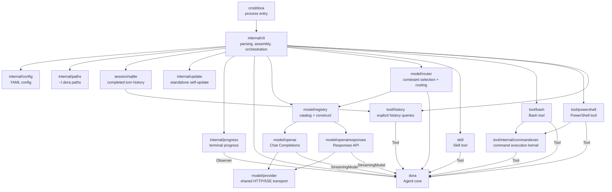
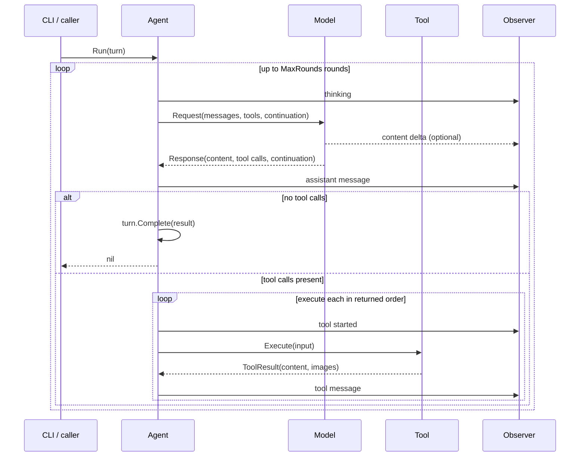

# Dora Architecture

This document describes the module boundaries, dependencies, primary interfaces, and runtime flow of the current Dora implementation. It records the current state, not future plans; when code behavior changes, this document should be updated accordingly.

## Design Goals

Dora is a small, composable LLM agent. The core design principles are:

- The core loop depends only on a small set of interfaces, not on any concrete model, tool, CLI, or storage implementation.
- Each package has a single primary responsibility; cross-package access happens through explicit interfaces or data structures.
- The CLI is the composition root, responsible for selecting and assembling implementations; the core packages do not read configuration or environment variables.
- One mutable `Turn` is explicitly passed to the Agent; `Agent` itself holds no mutable state across tasks.
- All external operations accept `context.Context`, supporting cancellation and timeouts.

## Overall Structure



Key constraints on dependency direction:

- The root package `dora` does not import any concrete implementation package within the project. `dora.Capability` and `dora.Constraints` are root value types shared by `model/registry` and `model/router` without an import cycle.
- Model adapters and tool packages depend on the interfaces and data structures in `dora`.
- `internal/*` serves only the Dora application and cannot be imported directly from outside the module.
- `internal/cli` knows all concrete implementations and is the composition root; model assembly is delegated to `model/router` (selection) and `model/registry` (construction).

## Directories and Modules

| Module | Responsibility | Primary interface or entry point |
| --- | --- | --- |
| `dora` | Domain abstractions for the agent loop, messages, models, tools, and observers | `New`, `NewWithConfig`, `Agent.Run*`, `Model`, `Tool`, `Observer` |
| `cmd/dora` | Process startup, signal handling, terminal capability detection, final error output | `main` |
| `internal/cli` | Argument parsing, dependency assembly, turn execution and completed-turn commit | `Run(context.Context, []string, IO)` |
| `internal/config` | Strict reading, parsing, and validation of YAML configuration | `Load(string)` |
| `internal/imagefile` | Validates local image files and encodes them as data URLs | `Validate`, `DataURL` |
| `internal/paths` | Resolves Dora's default configuration and skill paths | `ConfigFile`, `SkillsDir` |
| `session` | Defines completed-turn history contracts and query records | `Reader`, `Store` |
| `session/sqlite` | Appends completed turns to a user-selected SQLite file | `Open`, `Store.CommitTurn`, `Store.ListTurns`, `Store.GetRounds` |
| `internal/update` | Queries stable Releases, validates archives, and replaces the standalone binary with rollback | `New`, `Service.Update` |
| `internal/progress` | Renders semantic run events as terminal output | `New`, `Renderer.Observe` |
| `model/provider` | Shared HTTP transport, retry, SSE, and error infrastructure for model adapters | `New`, `Provider.PostStream` |
| `model/openai` | OpenAI-compatible Chat Completions SSE protocol adapter | `New`, `Client.GenerateStream` |
| `model/openairesponses` | Responses API, SSE stream, and provider continuation adapter | `New`, `Client.GenerateStream` |
| `model/registry` | Catalog registration/query (order = priority) and per-protocol adapter construction | `NewCatalog`, `Catalog.Providers`, `Construct` |
| `model/router` | Constraint-based selection, `dora.Model` routing with caching; internal `selection` | `New`, `Router.Generate`, `Router.GenerateStream`, `Router.View`, `Router.SetThinking` |
| `skill` | Discovers and validates local `SKILL.md`, returns full instructions to the model on demand | `New`, returns `dora.Tool` |
| `tool/bash` | Executes Bash within the current directory and under timeout and output-limit constraints | `New`, `Tool.Spec`, `Tool.Execute` |
| `tool/powershell` | Executes PowerShell using `pwsh` or `powershell.exe` | `New`, `Tool.Spec`, `Tool.Execute` |
| `tool/history` | Gives the model paginated access to completed turns and rounds | `New`, `Tool.Spec`, `Tool.Execute` |
| `tool/viewimage` | Loads a local image file or remote URL and returns a text description via a transient visual model | `New`, `Tool.SetViewer`, `Tool.Spec`, `Tool.Execute` |
| `tool/internal/commandexec` | Implements input validation, timeout, cancellation, output limits, and structured results for command tools | `New`, `Tool.Spec`, `Tool.Execute` |

## Core Interfaces

### Model

```go
type Model interface {
    Generate(context.Context, Request) (Response, error)
}

type StreamingModel interface {
    Model
    GenerateStream(context.Context, Request, func(ModelEvent)) (Response, error)
}
```

`Model` is the minimal interface that every model implementation must satisfy. `StreamingModel` is an optional capability; when the Agent detects it, it uses the streaming method, otherwise it falls back to `Generate`.

`Request` contains the complete provider-neutral messages, available tool definitions, and an opaque `Continuation`. `Response` can contain both text and multiple tool calls.

### Tool

```go
type Tool interface {
    Spec() ToolSpec
    Execute(context.Context, json.RawMessage) (ToolResult, error)
}

type ToolResult struct {
    Content string
}
```

`Spec` exposes the name, description, and JSON Schema to the model. `Execute` receives only the model-generated JSON arguments and returns content for the resulting tool message. The core Agent does not know the concrete type of a tool and does not parse tool-specific output conventions or access image files.

Within the same Agent, tool names must be non-empty and unique. Tool definitions are copied when the Agent is constructed, preventing the caller from later modifying their JSON Schemas.

### Observer

```go
type Observer interface {
    Observe(Update)
}
```

The Observer synchronously receives semantic events such as `thinking`, content deltas, message additions, tool starts, and tool failures. It only consumes run data, does not participate in Agent decisions, and cannot modify the session history.

Callbacks run on the Agent's current goroutine, so implementations should return quickly. `internal/progress.Renderer` is the Observer used by the CLI.

### Turn and Round

```go
type Round struct {
    Assistant Message
    Tools     []Message
}

turn := dora.NewTurn(systemPrompt, userInput)
err := agent.Run(ctx, turn)
result, complete := turn.Result()
```

`Turn` is the Agent's mutable run state. It begins with exactly one system and
one user message, appends only complete rounds, and ends with a final assistant
result without tool calls. A round contains one assistant message with one or
more tool calls and all corresponding tool messages in call order. Provider
continuation is opaque and exists only in the live Turn; it is not persisted.
All exported accessors return defensive copies.

## Agent Loop



Current execution semantics:

- The Agent is immutable; mutable messages and continuation belong to the supplied Turn.
- Input messages, tool calls, and output state are all defensively copied.
- Tool packages translate tool-specific output conventions into `ToolResult`; the Agent only forwards its content and images into the provider-neutral message history.
- When the model returns multiple tool calls, they are executed concurrently, but their results and Observer events are emitted in the returned order. Tools must be safe for concurrent use; the built-in command and skill tools are.
- Content from both APIs can be displayed as it is received, but tools must wait until the entire model response has finished before execution begins.
- A tool execution error, an unknown tool, or invalid JSON tool arguments does not terminate the task: the Agent feeds the failure back to the model as a `tool` message so the model can correct itself, and continues the loop. A tool itself may choose to encode a command failure as a normal result. For example, Bash returns a non-zero exit code to the model rather than terminating the Agent directly.
- If the model keeps calling tools, reaching `MaxRounds` returns `ErrMaxRounds`; the completed rounds remain in the same Turn. The CLI may call the Agent again with that Turn after interactive confirmation. Declining does not persist the incomplete Turn. Non-interactive runs report the error directly.
- The CLI creates every Turn with either the configured or concise built-in system prompt. Session-history behavior is described by the history tool itself rather than duplicated in the system prompt.

## CLI Run Flow

`internal/cli.Run` is responsible for the complete lifecycle of one command:

1. Parse arguments; `--version` and `-update` complete and exit before reading configuration or the prompt.
2. For a normal Agent run, compose the user prompt from command arguments and standard input.
3. Resolve the default or explicit configuration path; when the default file does not exist, use the built-in DeepSeek configuration, and when it does exist, strictly load the YAML. An explicitly specified configuration file that does not exist still reports an error.
4. Apply one-shot overrides such as `--max-rounds` and `--thinking` to the selected catalog entry.
5. If `--session` specifies a SQLite file, open it. When it already contains completed turns, register a history tool backed by its Reader interface; never load old turns into the model request.
6. Create the concrete model adapter based on the selected profile's effective API and model.
7. Discover skills and create the other available tools according to configuration.
8. Construct a stateless `dora.Agent` and a fresh `dora.Turn`.
9. Run the Agent, reusing only that Turn if the user confirms continuation after `ErrMaxRounds`.
10. On success, atomically append the completed Turn to SQLite and write its final text to stdout. Failed or declined Turns are not written.

The CLI's standard output carries only the final result; run progress and errors are written to standard error. TTY output is consistent with piped and redirected output, so results can still be safely used in scripts.

`cli.IO` injects the standard streams, build version, terminal capabilities, HTTP client, and test updater, allowing the CLI to be tested without depending on process-global state.

`internal/update` only updates binaries marked by the standalone installer writing a marker in the same directory. It fetches the latest stable Release from GitHub, selects the archive for the running platform, verifies the SHA-256 using `checksums.txt`, and stages and runs the new version's `--version` in the same directory. After successful verification, it switches the binary via a same-directory rename; on installation failure it attempts a rollback and uses an exclusive marker to reject concurrent updates. Development builds, manual copies, and package-manager installations are not modified.

## Model Adapters

### Chat Completions

`model/openai` converts Dora messages and tool structures into `/chat/completions` requests. It always requests an SSE stream, aggregates text and chunked tool arguments into a complete response, and implements `StreamingModel`; `Continuation` is empty.

### Responses API

`model/openairesponses` calls `/responses` and parses SSE. It implements `StreamingModel`, passes text deltas to the Agent, and encodes the typed items from the Responses protocol into an opaque continuation.

This continuation is used to preserve data across different CLI processes, such as reasoning, function calls, and function call output, which cannot be fully expressed by generic messages alone. It belongs only to the provider and backend that created it and should not be parsed or modified by other modules.

Both adapters are themselves responsible for:

- the endpoint and authentication headers;
- conversion between Dora messages and protocol messages;
- protocol wrapping of Tool JSON Schemas;
- interpretation of HTTP status and malformed response formats;
- response size or stream event size limits.

Sampling and output-cap settings are per-model configuration threaded from
`config.Model.MaxTokens` and `config.Model.Temperature` into each adapter's
`Config` and emitted in the request body with `omitempty` pointers. `temperature`
has no default and is only sent when explicitly configured, leaving the provider
default sampling otherwise. `max_tokens` defaults to 32768 in the config layer
and is therefore always sent. Because the two wire protocols use different key
names, the adapters map the single config concept to the correct key:
`max_tokens` for Chat Completions and `max_output_tokens` for the Responses API;
`temperature` is common to both. An explicit `max_tokens: 0` is relayed as-is,
meaning "no explicit cap."

Thinking-mode reasoning effort follows the same pattern. The CLI maps a single
`config.Model.Thinking` value (`off | minimal | low | medium | high`, nil by
default) to each protocol's control: Chat Completions emits `reasoning_effort`
for `minimal`–`high` and DeepSeek's `thinking.type: disabled` for `off`;
Responses emits a nested `reasoning` object with `effort: none` for `off` and
the effort value otherwise. The mapping is provider-aware and drops values a
provider does not support (for example DeepSeek ignores `minimal`; OpenAI Chat
Completions ignores `off`), so unsupported settings are silently absent from the
wire rather than erroring. The per-provider policy lives in `internal/cli`, and
the adapters only render the pre-computed fields.

The adapters do not validate the JSON of model-emitted tool-call arguments; they
pass the raw arguments through to the Agent, which is the single authority on
tool-call validity. Invalid arguments are fed back to the model as a recoverable
`tool` message rather than aborting the run.

## Session

The `session` package is a provider-neutral persistence contract. The CLI's
concrete implementation is `session/sqlite`; `--session`/`-s` is the path of
the SQLite database itself. There is no default session directory and no
automatic loading of prior messages.

The database uses schema version 2 and two tables:

- `turns`: one row per successfully completed invocation, including plain-text
  `system`, `user`, and final `result`, round count, and commit time;
- `messages`: intermediate assistant/tool messages keyed by `turn_id`,
  `round_index`, and `position`. Tool calls and images are JSON columns because
  they are structured fields of a message.

`CommitTurn` inserts the turn and all messages in one transaction (no backend
metadata). Incomplete Turns are rejected, so there is no status column. Provider
continuation is intentionally not stored. SQLite allocates the turn ID and
foreign keys bind every message to its turn. Older schema databases are
rejected rather than migrated.

`tool/history` is registered only when the selected session database already
contains at least one completed turn. An empty database exposes no history
tool. `list` returns completed turns newest first and includes the number of
rounds in each turn. `get` selects one turn by ID and returns a chronological
page of complete rounds; both actions accept `offset` and `limit`. History tool
calls and their results are ordinary messages in the current Turn and are
persisted with it on completion.

New database files are created with mode `0600`. The old versioned JSON session
format, `--fresh`, migration, and compatibility adapters are deliberately not
implemented.

## Skills

A skill is a tool, not text spliced directly into the prompt at startup. This way the model initially sees only the skill name and description, and only calls the `skill` tool to load the full content after deciding it is relevant.

By default, `~/.dora/skills` (or `DORA_HOME/skills`) is discovered first, followed by `~/.agents/skills/`. Each default directory is included only when it exists as a directory; an absent default is silently skipped. When `skills.directories` is configured, the defaults are replaced by exactly those directories (each must be an absolute path or start with `~/`). All resulting paths are converted to absolute form and deduplicated; `--no-skills` takes precedence over all sources and disables skills entirely. Each direct subdirectory must contain a valid `SKILL.md`:

- YAML front matter allows only `name` and `description`;
- the skill name must match the directory name and be globally unique;
- the file must be a regular file and satisfy the count, size, and description-length limits;
- when no default directory exists, or no directory contains a subdirectory with a `SKILL.md`, the entire tool stays disabled;
- when an explicitly configured directory does not exist or is not an absolute/`~/` path, or a skill is malformed, startup fails.

The tool execution result contains the skill's absolute directory and the complete `SKILL.md`, so instructions can reference scripts in the same directory. The skill tool itself does not execute files; execution still requires another explicitly enabled tool, such as Bash.

## Bash Tool

Bash is enabled automatically on Linux and macOS and disabled automatically on other platforms. When it is auto-enabled but the `bash` executable cannot be found, the CLI skips the tool; `enabled: true` can explicitly enable it on any platform, in which case a missing executable causes startup to fail. Discovery currently only checks `PATH` and does not launch a shell to probe the runtime environment. When the tool is available, each invocation executes via `bash -lc` in Dora's current directory; when the model needs to change directories, it uses `cd` within the command. The tool has the following boundaries:

- a default timeout of 120 seconds;
- each tool call can override the configured default with `timeout_seconds`, ranging from 1 to 3600 seconds;
- stdout and stderr are each subject to output limits;
- context cancellation terminates the child process;
- the result returns the exit code, stdout, stderr, timeout, and truncation status as JSON;
- a non-zero command exit is a tool result the model can handle; infrastructure errors such as startup failures are returned as Go errors.

Bash is not a security sandbox. Enabling it is equivalent to allowing the model to execute commands with the system privileges of the Dora process.

## PowerShell Tool

PowerShell is a separate `powershell` tool from Bash, and its input Schema likewise accepts only `command`, preventing the model from mixing the syntax of the two shells in a single call. It is enabled automatically on Windows and disabled automatically on other platforms, and looks for `pwsh` and then `powershell.exe` in order. In automatic mode, when neither exists the CLI skips the tool; when explicitly enabled, it reports an error. Bash and PowerShell can be exposed simultaneously only when the user explicitly overrides the platform policy.

PowerShell executes commands in Dora's current directory using `-NoLogo -NoProfile -NonInteractive -Command`, and the model uses `Set-Location` within the command to change directories. It shares the same 120-second configured default timeout, the 1-to-3600-second per-call override range, output limits, and structured results as Bash, and is likewise not a security sandbox.

Bash and PowerShell remain separate public tools with separate shell-launch policies, and both delegate to `tool/internal/commandexec` for input validation, timeout and cancellation, process execution, output truncation, and result encoding. This internal package cannot be imported from outside the module.

## Configuration and Paths

`internal/config` uses strict YAML decoding for a provider/model-profile catalog: unknown fields, multiple documents, duplicate names, invalid API types, invalid capability values, and negative limits all report errors. `builtin_providers.yaml` is embedded into the binary and defines the built-in `deepseek` and `trust` catalogs, including base URLs and default profiles. Within `providers[].models`, `name` uniquely identifies a profile while `model` is the provider-facing model identifier; `model` defaults to `name`, and different profiles may target the same model. A profile's positive `context_window` records its approximate context capacity; omission defaults to 1 MiB. A profile's `capabilities` advertises the provider-neutral capabilities it supports (for example `text`, `image_input`). Explicit user catalog fields override connection defaults, while user model lists replace rather than merge with built-in models. Each provider's API key environment variable is derived by uppercasing its name, replacing non-alphanumeric characters with underscores, and appending `_API_KEY`; a non-empty process value overrides the config-local `env` fallback, and normalization collisions or unknown config env names are rejected. These fallbacks never mutate the process environment.

Model selection is driven by per-capability policy, keyed by capability name: `policy.text` and `policy.image`, each an optional `{provider, profile}`; absence means `auto` (the router selects the first catalog entry satisfying the capability). The corresponding environment overrides are `DORA_POLICY_<CAPABILITY>_<FIELD>`, for example `DORA_POLICY_TEXT_PROVIDER` and `DORA_POLICY_IMAGE_PROFILE`. `text` maps to the `text` capability and `image` maps to `image_input`. Selection is pure order-plus-constraints: provider order then model order within a provider wins; `text` must be declared explicitly. The command tools' `enabled` is a three-state configuration: when absent, the CLI applies the platform policy; an explicit `true` or `false` fully overrides it. When the default configuration path does not exist, the CLI uses the built-in catalog directly; an explicit `--config` does not silently fall back.

`internal/paths` uses a unified `~/.dora` layout on all operating systems:

| Content | Default path |
| --- | --- |
| Optional configuration | `~/.dora/config.yaml` |
| Skills | `~/.dora/skills` |

The `DORA_HOME` environment variable can override the home directory and must be an absolute path. An explicit `--config` does not depend on the default configuration path and can fully override it.

## Extension Approaches

### Adding a model provider

1. A common OpenAI-protocol-compatible provider can register built-in connection defaults; models remain explicit catalog entries.
2. A new protocol requires implementing `dora.StreamingModel` in a separate `model/<protocol>` package.
3. Encapsulate protocol-specific state in `Continuation`; do not leak it into the Agent core.
4. Create the implementation in the composition logic of `internal/cli`.
5. Add tests for defaults, protocol conversion, error responses, and CLI assembly.

### Adding a tool

1. Implement `dora.Tool` in a separate package.
2. Define a strict JSON Schema for the input and strictly parse the `Execute` arguments.
3. Add an explicit enable option and resource limits to the configuration.
4. Assemble the tool only in `internal/cli`; do not modify the Agent loop.

### Adding a new run interface

A new UI can call the root-package Agent directly, create a `Turn`, and implement its own `Observer`. It does not need to depend on the terminal renderer and can implement the `session.Store` contract itself.

## Current Boundaries

- The Agent loop is single-goroutine, but the tool calls within one model response are executed concurrently (results are collected by index and emitted in order).
- HTTP request asynchrony is determined by the caller's goroutine; the core has no task scheduler.
- Both Chat Completions and Responses support streaming text display, but completed tool calls are not yet executed early while the stream is still running.
- Session history is append-only at the turn level; individual turns are committed once after completion.
- SQLite serializes writers and uses a five-second busy timeout; Dora does not add a separate cross-process lock.
- The CLI is the composition root; as providers and tools grow, a factory/registry could be extracted, but at the current scale keeping an explicit switch is simpler.
- There is currently no event bus, interactive REPL, or background daemon.
