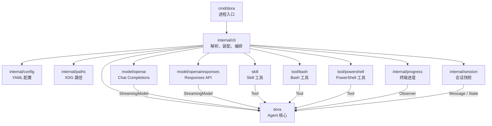
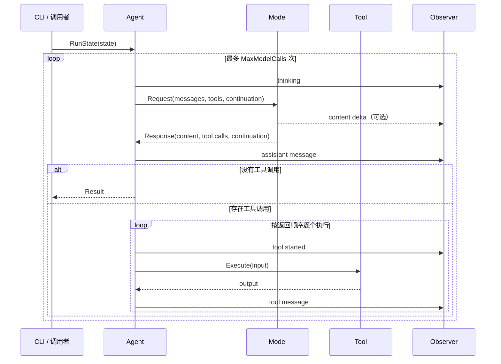

# Dora 架构

本文描述 Dora 当前实现的模块边界、依赖关系、主要接口和运行流程。它记录的是现状，而不是未来规划；代码行为改变时应同步更新本文。

## 设计目标

Dora 是一个小型、可组合的 LLM Agent。核心设计原则是：

- 核心循环只依赖少量接口，不依赖具体模型、工具、CLI 或存储实现。
- 每个包只有一个主要职责，跨包访问通过明确接口或数据结构完成。
- CLI 是组合根，负责选择和装配实现，核心包不读取配置或环境变量。
- 会话状态由调用者显式传入和取回，`Agent` 本身不持有跨任务的可变状态。
- 所有外部操作接受 `context.Context`，支持取消和超时。

## 总体结构



依赖方向的关键约束：

- 根包 `dora` 不导入项目内的任何具体实现包。
- 模型适配器和工具包依赖 `dora` 中的接口与数据结构。
- `internal/*` 只服务 Dora 应用，不能被模块外部直接导入。
- `internal/cli` 知道所有具体实现，是当前唯一的组合根。

## 目录与模块

| 模块 | 职责 | 主要接口或入口 |
| --- | --- | --- |
| `dora` | Agent 循环、消息、模型、工具、观察者等领域抽象 | `New`、`NewWithConfig`、`Agent.Run*`、`Model`、`Tool`、`Observer` |
| `cmd/dora` | 进程启动、信号处理、终端能力检测、最终错误输出 | `main` |
| `internal/cli` | 参数解析、依赖装配、session 恢复与保存、输入输出编排 | `Run(context.Context, []string, IO)` |
| `internal/config` | 严格读取、解析和校验 YAML 配置 | `Load(string)` |
| `internal/paths` | 在所有平台解析统一的 XDG 默认路径 | `ConfigFile`、`SessionsDir`、`SkillsDir` |
| `internal/session` | 持久化具名会话，校验版本和并发 revision | `New`、`Store.Load`、`Store.Revision`、`Store.Save` |
| `internal/progress` | 将语义化运行事件渲染成终端输出 | `New`、`Renderer.Observe` |
| `model/openai` | OpenAI-compatible Chat Completions SSE 协议适配 | `New`、`Client.GenerateStream` |
| `model/openairesponses` | Responses API、SSE 流和 provider continuation 适配 | `New`、`Client.GenerateStream` |
| `skill` | 发现并校验本地 `SKILL.md`，按需向模型返回完整指令 | `New`，返回 `dora.Tool` |
| `tool/bash` | 在当前目录及超时和输出上限约束内执行 Bash | `New`、`Tool.Spec`、`Tool.Execute` |
| `tool/powershell` | 使用 `pwsh` 或 `powershell.exe` 执行 PowerShell | `New`、`Tool.Spec`、`Tool.Execute` |

## 核心接口

### Model

```go
type Model interface {
    Generate(context.Context, Request) (Response, error)
}

type StreamingModel interface {
    Model
    GenerateStream(context.Context, Request, func(ModelEvent)) (Response, error)
}
```

`Model` 是所有模型实现必须满足的最小接口。`StreamingModel` 是可选能力；Agent 检测到它后会使用流式方法，否则回退到 `Generate`。

`Request` 包含完整的 provider-neutral 消息、可用工具定义和不透明的 `Continuation`。`Response` 可以同时包含文本和多个工具调用。

### Tool

```go
type Tool interface {
    Spec() ToolSpec
    Execute(context.Context, json.RawMessage) (string, error)
}
```

`Spec` 向模型暴露名称、说明和 JSON Schema。`Execute` 只接收模型生成的 JSON 参数并返回文本结果。核心 Agent 不知道工具的具体类型。

同一个 Agent 中工具名必须非空且唯一。工具定义在构造 Agent 时复制，防止调用方之后修改其 JSON Schema。

### Observer

```go
type Observer interface {
    Observe(Update)
}
```

Observer 同步接收 `thinking`、内容增量、消息加入、工具开始和工具失败等语义事件。它只消费运行数据，不参与 Agent 决策，也不能修改会话历史。

回调运行在 Agent 当前 goroutine 中，因此实现应快速返回。`internal/progress.Renderer` 是 CLI 使用的 Observer。

### State 与 Result

```go
type State struct {
    Messages     []Message
    Continuation string
}

type Result struct {
    Content      string
    Messages     []Message
    Continuation string
}
```

`State` 是一次运行的完整输入状态，`Result` 返回可直接用于下一次运行的完整状态。`Continuation` 由 provider 拥有，Agent 和 session 存储都将它视为不透明字符串。

## Agent 循环



当前执行语义：

- Agent 不可变，运行历史保存在局部变量中。
- 输入消息、工具调用和输出状态均进行防御性复制。
- 模型返回多个工具调用时，按返回顺序串行执行。
- 两种 API 的内容都可以边接收边显示，但工具必须等整次模型响应完成后才开始执行。
- 工具执行错误会终止本次任务；工具自身可以选择把命令失败编码成正常结果。例如 Bash 将非零退出码返回给模型，而不是直接终止 Agent。
- 如果模型持续调用工具，达到 `MaxModelCalls` 后返回明确错误；默认上限为 64。
- 当前 CLI 不注入系统提示词。`Message` 和两个 API adapter 都支持 `system` role，库调用者可以自行传入。

## CLI 运行流程

`internal/cli.Run` 负责一次命令的完整生命周期：

1. 解析参数，从命令参数和标准输入组合用户 prompt。
2. 解析默认或显式配置路径，严格加载 YAML。
3. 应用 `--model`、`--base-url` 等单次覆盖项。
4. 若指定 session，读取快照并校验 provider、API、model 和 base URL。
5. 根据 `model.api` 创建具体模型适配器；provider 负责提供服务商默认值。
6. 发现 skills，并按配置创建可用工具。
7. 构造无状态的 `dora.Agent`。
8. 将历史消息和本次用户消息组成 `State`，执行 Agent。
9. 成功后原子保存 session，并将最终文本写到标准输出。

CLI 的标准输出只承载最终结果；运行过程和错误写到标准错误，因此结果可以安全地用于管道。

`cli.IO` 将标准流、终端能力、HTTP client 和测试 session 目录作为依赖注入，使 CLI 无需依赖进程全局状态即可测试。

## 模型适配器

### Chat Completions

`model/openai` 将 Dora 消息和工具结构转换为 `/chat/completions` 请求。它固定请求 SSE 流，将文本和分片工具参数聚合成完整响应，并实现 `StreamingModel`；跨任务恢复依赖完整消息历史，`Continuation` 为空。

### Responses API

`model/openairesponses` 调用 `/responses` 并解析 SSE。它实现 `StreamingModel`，将文本增量传给 Agent，同时把 Responses 协议中的 typed items 编码进不透明 continuation。

这个 continuation 用于在不同 CLI 进程之间保留 reasoning、function call 和 function call output 等不能仅靠通用消息完整表达的数据。它只属于创建它的 provider 和 backend，不应由其他模块解析或修改。

两个适配器都自行负责：

- endpoint 和认证头；
- Dora 消息与协议消息的转换；
- Tool JSON Schema 的协议封装；
- HTTP 状态与响应格式错误的解释；
- 响应大小或流事件大小限制。

## Session

`internal/session` 使用单个版本化 JSON 文件保存一个具名任务：

```text
${XDG_STATE_HOME:-$HOME/.local/state}/dora/sessions/<name>.json
```

快照包含：

- 格式版本和单调递增的 revision；
- provider、API、model、base URL 组成的 backend 身份；
- provider-neutral 完整消息；
- provider 专属 continuation。

保存采用同目录临时文件、`fsync` 和原子 rename，目录权限为 `0700`，文件权限为 `0600`。`Save` 使用 expected revision 检测并发覆盖，但不提供跨进程锁；两个进程同时操作同名 session 时，其中一个最终会收到冲突错误。

普通恢复要求 backend 完全一致。`--fresh` 忽略旧内容，在任务成功后以新格式和 backend 替换文件。Session v1 不支持恢复，但可以通过 `--fresh` 显式替换。

## Skills

Skill 是一个工具，而不是启动时直接拼入 prompt 的文本。这样模型最初只看到 skill 名称和描述，判断相关后才调用 `skill` 工具加载完整内容。

默认发现活动配置文件旁边的 `skills/`，配置还可以添加其他父目录。每个直接子目录必须包含合法的 `SKILL.md`：

- YAML front matter 只允许 `name` 和 `description`；
- skill 名称必须与目录名一致并全局唯一；
- 文件必须是普通文件，且满足数量、大小和描述长度限制；
- 默认目录不存在，或其中没有任何包含 `SKILL.md` 的子目录时，整个工具保持禁用；
- 显式配置的目录不存在或 skill 格式错误时，启动失败。

工具执行结果包含 skill 的绝对目录和完整 `SKILL.md`，因此指令可以引用同目录脚本。Skill 工具本身不执行文件；执行仍需另一个明确启用的工具，例如 Bash。

## Bash 工具

Bash 默认启用；如果系统找不到 `bash` 可执行文件，CLI 会跳过该工具而不阻止 Dora 启动。用户可以通过配置显式禁用。工具可用时，每次调用通过 `bash -lc` 在 Dora 当前目录中执行；模型需要切换目录时在命令内使用 `cd`。工具具备以下边界：

- 默认超时 30 秒；
- 每次工具调用可用 `timeout_seconds` 覆盖配置默认值，范围为 1 至 3600 秒；
- stdout 和 stderr 各自受输出上限约束；
- context 取消会终止子进程；
- 结果以 JSON 返回退出码、stdout、stderr、超时和截断状态；
- 命令非零退出属于模型可处理的工具结果，启动失败等基础设施错误才作为 Go error 返回。

Bash 不是安全沙箱。启用它等于允许模型以 Dora 进程的系统权限执行命令。

## PowerShell 工具

PowerShell 是与 Bash 分离的 `powershell` 工具，输入 Schema 同样只接受 `command`，避免模型把两种 shell 的语法混在一次调用中。它默认启用并依次寻找 `pwsh`、`powershell.exe`；两者都不存在时，CLI 跳过该工具。若 Bash 与 PowerShell 都存在，两个工具会同时暴露。

PowerShell 使用 `-NoLogo -NoProfile -NonInteractive -Command` 在 Dora 当前目录执行命令，切换目录时由模型在命令内使用 `Set-Location`。它与 Bash 使用相同的 30 秒配置默认超时、1 至 3600 秒的单次调用覆盖范围、输出限制和结构化结果，同样不是安全沙箱。

## 配置与路径

`internal/config` 使用严格 YAML 解码：未知字段、多文档、非法 provider、非法 API 类型和负数限制都会报错。`openai` 与 `deepseek` provider 提供各自的 endpoint、model 和 API key 环境变量默认值；显式字段覆盖默认值。API key 可以直接配置，也可以运行时从指定环境变量读取，非空的直接配置优先。

`internal/paths` 在所有操作系统上使用统一 XDG 布局：

| 内容 | 默认路径 |
| --- | --- |
| 配置 | `${XDG_CONFIG_HOME:-$HOME/.config}/dora/config.yaml` |
| Skills | 活动配置文件同级的 `skills/` |
| Sessions | `${XDG_STATE_HOME:-$HOME/.local/state}/dora/sessions` |

XDG 环境变量必须是绝对路径。显式 `--config` 不依赖默认配置路径，可以完全覆盖它。

## 扩展方式

### 添加模型 provider

1. OpenAI 协议兼容服务商只需在配置 preset 中注册 provider 及默认 endpoint、model 和 API key 环境变量。
2. 新协议需要在独立 `model/<protocol>` 包中实现 `dora.StreamingModel`。
3. 将协议专属状态封装进 `Continuation`，不要泄漏到 Agent 核心。
4. 在 `internal/cli` 的组合逻辑中创建实现。
5. 添加默认值、协议转换、错误响应和 CLI 组装测试。

### 添加工具

1. 在独立包中实现 `dora.Tool`。
2. 为输入定义严格 JSON Schema，并严格解析 `Execute` 参数。
3. 在配置中加入显式启用项和资源限制。
4. 只在 `internal/cli` 中装配工具，不修改 Agent 循环。

### 添加新的运行界面

新的 UI 可以直接调用根包 Agent，并实现自己的 `Observer`。它不需要依赖终端 renderer，也可以自行决定 State 的存储方式。

## 当前边界

- Agent 和工具调用目前是单 goroutine、串行执行。
- HTTP 请求异步性由调用方 goroutine 决定；核心没有任务调度器。
- Chat Completions 和 Responses 都支持流式文本显示，但尚未在流未结束时提前执行已完成的工具调用。
- Session 是完整 JSON 快照而非追加日志，最大 64 MiB。
- Session 没有跨进程锁，只通过 revision 防止静默覆盖。
- CLI 是组合根；provider 和工具增多后，可以再提取 factory/registry，但当前规模下保持显式 switch 更简单。
- 当前没有内置系统提示词、事件总线、交互式 REPL 或后台守护进程。
